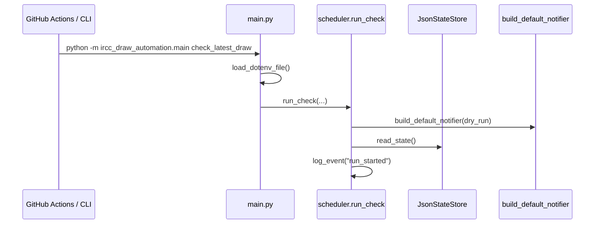
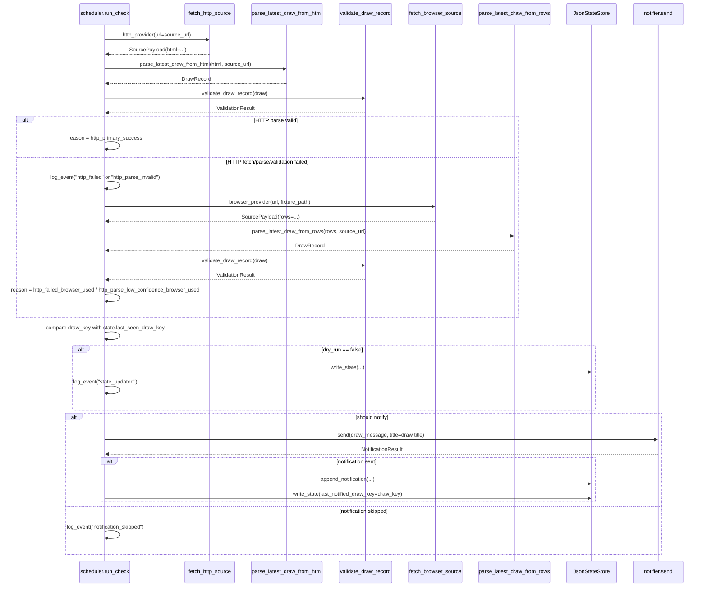
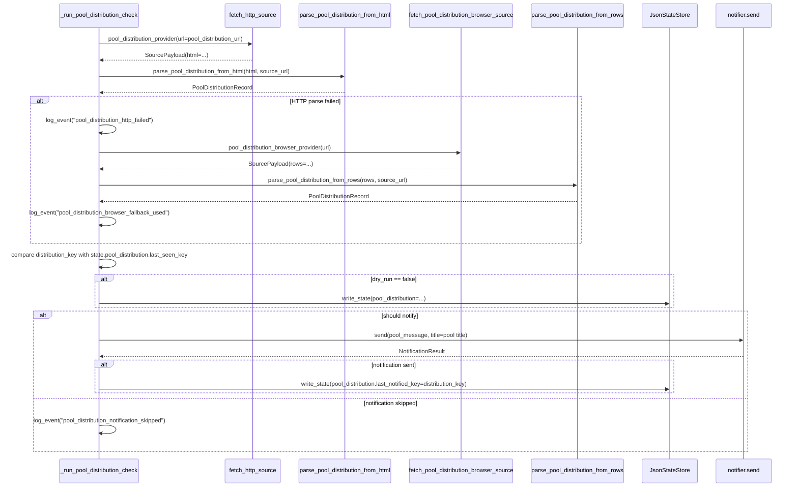
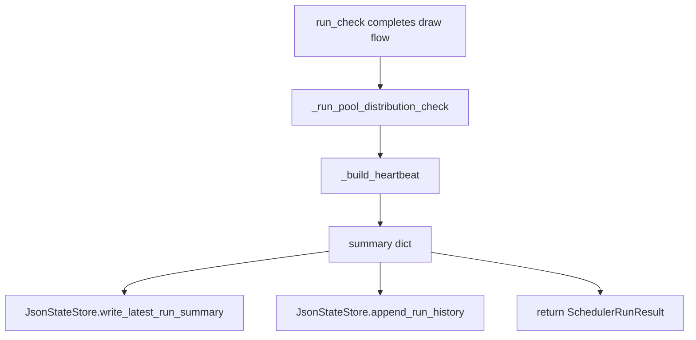

# Runtime Flow

This file shows the actual code path for the scheduler, parser, MCP fallback, state updates, and notifications.

## Main Entry

## Draw Flow

## Pool Distribution Flow

## Summary And History

## Method Order

Typical production run:

1. `main.main()`
2. `load_dotenv_file()`
3. `scheduler.run_check()`
4. `build_default_notifier()`
5. `JsonStateStore.read_state()`
6. `log_event("run_started")`
7. Draw branch:
   - `fetch_http_source()` or injected provider
   - `parse_latest_draw_from_html()`
   - `validate_draw_record()`
   - optional fallback:
     - `fetch_browser_source()`
     - `parse_latest_draw_from_rows()`
8. Draw change detection and optional notification
9. `_run_pool_distribution_check()`
10. Pool branch:
   - `fetch_http_source()` or injected provider
   - `parse_pool_distribution_from_html()`
   - optional fallback:
     - `fetch_pool_distribution_browser_source()`
     - `parse_pool_distribution_from_rows()`
11. Pool change detection and optional notification
12. `_build_heartbeat()`
13. `JsonStateStore.write_latest_run_summary()`
14. `JsonStateStore.append_run_history()`
15. return `SchedulerRunResult`

## Important Files

- `src/ircc_draw_automation/main.py`
- `src/ircc_draw_automation/scheduler.py`
- `src/ircc_draw_automation/fetcher.py`
- `src/ircc_draw_automation/parser.py`
- `src/ircc_draw_automation/browser_source.py`
- `src/ircc_draw_automation/mcp_client.py`
- `mcp/playwright_server.mjs`
- `src/ircc_draw_automation/state_store.py`
- `src/ircc_draw_automation/notifier.py`
